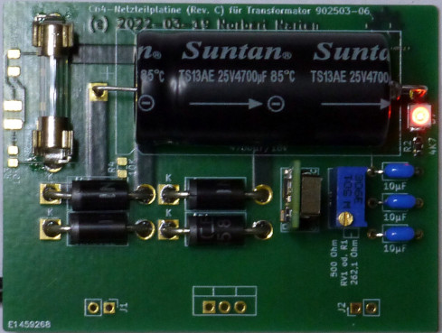

# C64-PSU-PCB-Replacement

## PSU PCB Replacement for the Commodore C64 PSU 902503-06

 Here is my soloution for the C64 Power Supply Unit probelm when the Power Supply Unit is going to fail or it's too old. I've developed a Power Supply Unit PCB to replace the original PCB. The build in 7805 will be used as a mounting point to install the new PCB in the Transformer housing. The new PCB is using an adjustable DC/DC Converter to get the 5.1V and there is up to 10 watts of power left that doesn't converted into heat anymore.

